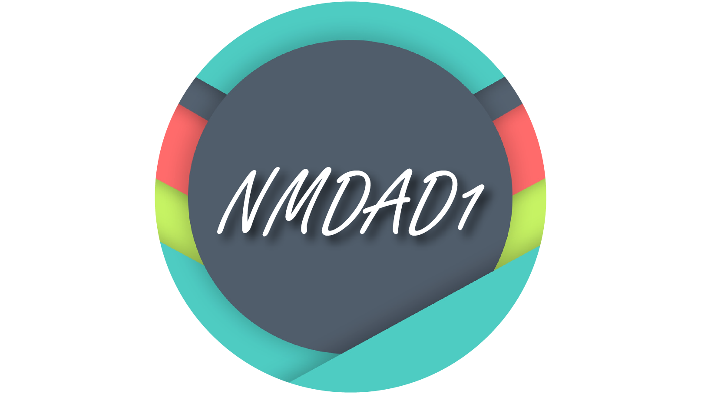

Jonas Janzegers
================================

|Info|  |
|----|---|
|Olod|New Media Design & Development I|
|Auteur(s)|Philippe De Pauw - Waterschoot, Jonas Pottie|
|Opleiding|Bachelor in de Grafische en digitale media|
|Academiejaar|2015-16|
|ECTS-fiche|https://bamaflexweb.arteveldehs.be/BMFUIDetailxOLOD.aspx?a=47532&b=5&c=1|

***

Documenten
----------

* [Résumé](https://github.com/jonajanz/gdm-201516-nmdad1/blob/master/docs/R%C3%A9sum%C3%A9.md)

Taken
-----
* [Résumé](https://github.com/jonajanz/gdm-201516-nmdad1/blob/master/docs/R%C3%A9sum%C3%A9.md)

Auteur
--------

**Jonas Janzegers**

Arteveldehogeschool
-------------------

- <http://www.arteveldehogeschool.be>
- <http://www.arteveldehogeschool.be/ects>
- <http://www.arteveldehogeschool.be/bachelor-de-grafische-en-digitale-media>
- <http://twitter.com/bachelorGDM>
- <https://www.facebook.com/BachelorGrafischeEnDigitaleMedia?fref=ts>

Copyright and license
---------------------

By Jonas Janzegers

